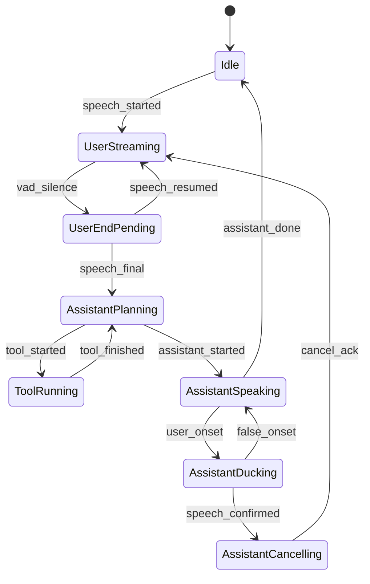

# Voice Conversation Redesign

## 1. 목표

이 문서는 SodaAgent의 실시간 음성 대화 루프를 다음 기준에 맞게 재설계하기 위한 구체 설계안이다.

- 사용자와 에이전트의 발화가 자연스럽게 이어질 것
- 사용자가 에이전트 말을 끊을 때 즉시 반응할 것
- 인터럽트 이후에도 대화 문맥이 깨지지 않을 것
- 모바일 앱과 PSTN(Twilio) 경로가 같은 턴 제어 모델을 공유할 것
- 툴 호출, 지연, 재연결, 네트워크 흔들림이 있어도 상태가 일관될 것

현재 구현은 실시간 음성 스트리밍 자체는 동작하지만, 턴 전환과 인터럽트를 독립된 상태 기계로 다루지 않아 자연스러운 음성 UX를 만들기 어렵다.

## 2. 현재 구조의 근본 문제

### 2.1 인터럽트가 "재생 중단"이지 "응답 취소"가 아님

현재 `interrupted`는 사실상 클라이언트 플레이어를 멈추라는 신호다. 서버는 인터럽트 이후에도 같은 assistant response에서 오는 이벤트를 계속 전달할 수 있다. 그 결과:

- 사용자가 끼어들어도 직전 응답 오디오가 다시 재생될 수 있음
- transcript가 이전 응답과 새 사용자 발화를 섞어 기록할 수 있음
- 툴 호출 이후의 후속 응답이 stale 상태로 도착할 수 있음

### 2.2 음성 턴 경계가 모델 이벤트에 과도하게 의존함

현재는 마이크를 켜면 PCM을 계속 서버로 보내고, 사용자의 발화 시작/종료를 별도 상태로 다루지 않는다. 그래서:

- 사용자의 발화 시작 시점과 진짜 인터럽트 시점을 구분하기 어려움
- 짧은 잡음/기침/도로 소음에도 민감해질 수 있음
- assistant가 언제 완전히 끝났는지 명확하지 않음

### 2.3 partial transcript와 committed transcript가 분리되어 있지 않음

현재 transcription이 들어올 때마다 그대로 transcript 목록에 append한다. 이 방식은:

- 자막이 아니라 "중복 로그"를 만들기 쉬움
- 같은 발화의 중간 결과와 최종 결과를 구분하지 못함
- 오디오 파일과 텍스트를 한 턴으로 결합하기 어려움

### 2.4 툴 후속 발화 복구가 회복 전략이 아니라 문맥 오염을 유발함

현재는 툴 호출 후 모델이 음성을 내지 않으면 서버가 툴을 다시 실행하고, 그 결과를 새 user message처럼 재주입한다. 이 방식은:

- 한 턴 안의 assistant continuation을 별도 user turn처럼 왜곡함
- 인터럽트 직후 불필요한 후속 발화를 유발할 수 있음
- 추후 세션 저장 시 대화 기록 정합성이 무너짐

### 2.5 세션 복구와 실시간 연결 복구의 단위가 다름

앱은 재연결을 시도하지만 대화 identity가 안정적이지 않고, 서버는 `InMemorySessionService`로 새 세션을 만든다. 이 조합에서는:

- 연결이 잠깐 끊겨도 사용자 입장에서는 "같은 대화"처럼 보여야 하는데 실제로는 새 세션이 됨
- 인터럽트/취소/도구 결과가 재연결 이후 이어지지 않음

## 3. 재설계 원칙

### 3.1 서버가 턴 상태의 authoritative source가 된다

모바일은 입력 장치와 즉시 UX를 담당하고, 최종 대화 상태는 서버가 결정한다.

서버가 책임질 것:

- 현재 대화(conversation) ID
- 현재 user turn / assistant turn ID
- 어느 assistant turn이 active / cancelled / completed 인지
- 어떤 transcript가 partial인지 final인지
- 어떤 오디오 chunk가 stale인지

### 3.2 인터럽트는 2단계로 처리한다

1. `duck`: 사용자가 말하기 시작할 가능성이 보이면 assistant 재생 볼륨 또는 출력 버퍼를 즉시 낮춤
2. `cancel`: 사용자의 실제 발화가 일정 시간 이상 유지되면 현재 assistant turn을 취소하고 이후 chunk를 폐기

이 2단계가 있어야 과민한 false interrupt 없이 반응성을 확보할 수 있다.

### 3.3 transcript는 "라이브 캡션"과 "대화 히스토리"를 분리한다

- partial transcript: 현재 말하고 있는 내용을 화면에 갱신
- final transcript: 발화가 종료되었을 때만 conversation history에 commit

### 3.4 오디오, 텍스트, 툴 이벤트는 모두 turn-scoped여야 한다

모든 서버 이벤트는 최소한 다음 중 일부를 포함해야 한다.

- `conversation_id`
- `turn_id`
- `parent_turn_id`
- `seq`
- `is_final`

이 구조가 있어야 stale audio drop, reconnect replay suppression, transcript merge가 가능해진다.

## 4. 목표 UX

### 4.1 사용자가 조용히 듣고 있을 때

- assistant 음성이 150ms 내에 재생 시작
- 자막은 문장 단위로 자연스럽게 누적
- 툴 호출이 있어도 짧은 thinking 후 바로 음성 재개

### 4.2 사용자가 assistant 말을 자를 때

- 사용자 음성 onset 감지 후 100ms 내 duck
- 실제 발화 지속이 200ms 이상이면 assistant turn cancel
- cancel 이후 stale 오디오가 다시 나오지 않음
- 사용자의 새 발화가 다음 user turn으로 바로 이어짐

### 4.3 사용자가 아주 짧게 "아니", "잠깐", "그만"처럼 말할 때

- assistant가 길게 겹쳐 말하지 않음
- 가능한 한 첫 음절 손실 없이 기록
- 이전 응답의 남은 transcript가 히스토리에 섞이지 않음

## 5. 공통 도메인 모델

### 5.1 Conversation

```text
Conversation
- conversation_id
- user_id
- created_at
- last_activity_at
- active_turn_id
- last_committed_turn_id
```

### 5.2 Turn

```text
Turn
- turn_id
- conversation_id
- role: user | assistant | tool
- parent_turn_id: assistant turn이 user turn에 응답하는 관계
- status: pending | streaming | cancelling | cancelled | completed | failed
- started_at
- ended_at
- interruption_of: optional assistant turn id
```

### 5.3 Utterance

```text
Utterance
- utterance_id
- turn_id
- role
- text_partial
- text_final
- audio_started_at
- audio_ended_at
- committed
```

### 5.4 ToolExecution

```text
ToolExecution
- tool_call_id
- assistant_turn_id
- tool_name
- args
- status: started | completed | failed | abandoned
- summary_for_speech
```

## 6. 서버 상태머신

서버는 각 conversation마다 아래 상태를 관리한다.

### 6.1 Conversation Runtime State

```text
Idle
UserStreaming
UserEndPending
AssistantPlanning
AssistantSpeaking
AssistantDucking
AssistantCancelling
ToolRunning
ReconnectGrace
```

### 6.2 주요 전이



### 6.3 서버가 반드시 보장해야 하는 규칙

- cancelled 된 assistant turn에서 나온 오디오는 클라이언트로 보내지지 않는다
- 같은 `turn_id`의 partial transcript는 update 되고 append 되지 않는다
- user turn이 final 되기 전에는 assistant turn이 생성되지 않는다
- reconnect 이후 이전 connection에서 늦게 도착한 이벤트는 `seq`와 `turn_id`로 폐기한다

## 7. 클라이언트 상태머신

현재 `idle/listening/thinking/speaking` 네 상태로는 부족하다. 아래처럼 분리한다.

```text
disconnected
connecting
ready
user_listening
user_speaking
assistant_preparing
assistant_speaking
assistant_ducking
assistant_interrupted
tool_waiting
error
```

### 7.1 클라이언트가 담당할 것

- 로컬 VAD로 speech onset/offset 추정
- assistant 음성 재생 버퍼 제어
- partial caption UI 렌더링
- 서버로부터 받은 `turn_id` 기준 stale event 무시

### 7.2 클라이언트가 담당하지 말아야 할 것

- 최종 turn completion 결정
- 툴 결과를 대화 맥락으로 다시 합성하는 일
- assistant cancellation의 최종 판단

## 8. 새 WebSocket 프로토콜

현재 프로토콜은 최소 기능만 있고 턴 제어 정보가 없다. 아래처럼 확장한다.

### 8.1 Client -> Server

```json
{"type":"session_start","conversation_id":"optional-stable-id","device_id":"...","capabilities":{"vad":true,"ducking":true}}
{"type":"audio_chunk","turn_id":"user-turn-123","seq":17,"data":"<base64 pcm>"}
{"type":"speech_started","turn_id":"user-turn-123","audio_offset_ms":1840}
{"type":"speech_partial","turn_id":"user-turn-123","text":"잠깐"}
{"type":"speech_final","turn_id":"user-turn-123","text":"잠깐, 다른 길로 가자","end_of_turn":true}
{"type":"text_turn","turn_id":"user-turn-124","text":"내일 일정 알려줘"}
{"type":"playback_event","turn_id":"assistant-turn-555","event":"playback_started"}
{"type":"playback_event","turn_id":"assistant-turn-555","event":"playback_flushed"}
{"type":"client_interrupt_ack","turn_id":"assistant-turn-555"}
```

### 8.2 Server -> Client

```json
{"type":"session_ready","conversation_id":"conv-1","resume_token":"..."}
{"type":"turn_started","turn_id":"assistant-turn-555","parent_turn_id":"user-turn-123","role":"assistant"}
{"type":"assistant_chunk","turn_id":"assistant-turn-555","seq":3,"data":"<base64 pcm>","mime_type":"audio/pcm;rate=24000"}
{"type":"caption_partial","turn_id":"assistant-turn-555","text":"가장 빠른 경로를"}
{"type":"caption_final","turn_id":"assistant-turn-555","text":"가장 빠른 경로를 다시 찾고 있어요."}
{"type":"tool_started","turn_id":"assistant-turn-555","tool_name":"get_directions","args":{"destination":"..."}}
{"type":"tool_finished","turn_id":"assistant-turn-555","tool_name":"get_directions","summary":"강변북로 경로가 8분 더 빠릅니다."}
{"type":"assistant_duck","turn_id":"assistant-turn-555","reason":"user_onset"}
{"type":"assistant_cancelled","turn_id":"assistant-turn-555","reason":"barge_in_confirmed"}
{"type":"turn_committed","turn_id":"assistant-turn-555","status":"completed"}
{"type":"error","turn_id":"assistant-turn-555","message":"..."}
```

### 8.3 프로토콜 설계 규칙

- 오디오는 항상 `seq`를 가진다
- transcript와 audio는 같은 `turn_id`를 공유한다
- partial은 update 가능, final만 history commit 대상이다
- cancel 이후 같은 `turn_id`의 `assistant_chunk`는 무효다

## 9. 인터럽트 처리 알고리즘

### 9.1 입력 신호

인터럽트 판단은 단일 신호에 의존하지 않는다.

- 로컬 VAD onset
- 서버 수신 오디오 에너지
- Live API input transcription의 시작
- 사용자의 명시적 stop intent ("잠깐", "그만", "아니")

### 9.2 2단계 인터럽트

#### Stage A: Duck

조건:

- assistant가 speaking 중
- 로컬 VAD가 speech onset 가능성을 감지

동작:

- 클라이언트는 즉시 출력 볼륨을 낮추거나 버퍼 추가 재생을 멈춤
- 서버는 `assistant_duck` 상태로 전이
- 이 시점에는 아직 assistant turn을 cancel하지 않음

#### Stage B: Cancel

조건:

- onset이 200ms 이상 유지
- 또는 partial transcript가 1개 이상의 의미 있는 토큰을 생성

동작:

- 서버는 active assistant turn을 `cancelling`으로 전이
- 이후 해당 turn의 chunk는 websocket에 forward 하지 않음
- 클라이언트는 player buffer flush
- 새 user turn을 active turn으로 승격

### 9.3 False onset 복귀

조건:

- duck 이후 200ms 내 speech가 사라짐
- partial transcript 없음

동작:

- assistant speaking 복귀
- 이미 받은 오디오 버퍼가 있다면 재생 재개
- cancel은 발생시키지 않음

## 10. VAD 설계

현재는 VAD가 사실상 없다. 최소한 아래 수준은 필요하다.

### 10.1 모바일 로컬 VAD

권장 역할:

- speech onset 조기 감지
- duck 트리거
- end-of-turn 후보 생성

권장 파라미터 시작점:

- frame: 20ms
- onset threshold: 120~180ms
- offset threshold: 350~500ms
- hangover: 200ms
- pre-roll buffer: 200ms

### 10.2 서버 보조 판정

서버는 최종 판정만 한다.

- 로컬 VAD 이벤트가 와도 무조건 cancel하지 않음
- transcription onset, audio continuity, assistant state를 함께 본다
- noisy environment에서 false interrupt를 줄이기 위해 hysteresis 적용

## 11. Transcript 모델

### 11.1 UI 계층 분리

클라이언트는 transcript를 두 계층으로 관리한다.

- `liveCaption`
  - 현재 발화 중인 user/assistant의 partial 텍스트
  - 화면 상단 또는 현재 bubble만 갱신
- `conversationHistory`
  - final utterance만 보관
  - 오디오 파일, tool summary, timestamps와 연결

### 11.2 Commit 규칙

- `caption_partial`은 같은 bubble을 update
- `caption_final`이 오면 해당 bubble을 commit
- `assistant_cancelled`이면 해당 assistant partial은 history에 commit하지 않거나 `interrupted` 표시로 별도 저장

## 12. Tool 처리 재설계

툴은 assistant turn 내부에서 실행되는 하위 단계여야 한다.

### 12.1 현재 방식의 문제

- tool fallback이 synthetic user turn을 만든다
- 음성 대화 흐름이 끊긴다
- interrupt 직후 늦게 들어온 fallback speech를 막기 어렵다

### 12.2 목표 방식

툴 실행은 다음 단계로 고정한다.

1. assistant turn 시작
2. tool call 생성
3. server executes tool
4. server stores structured result
5. assistant continuation 생성
6. short spoken summary 생성

### 12.3 fallback 원칙

모델이 툴 결과 이후 오디오를 주지 않으면:

- 같은 `assistant_turn_id` 안에서 server-authored short summary를 생성
- 이 summary는 transcript와 audio 모두 같은 assistant turn에 귀속
- 절대 새로운 user message로 넣지 않음

## 13. 연결 복구 설계

### 13.1 stable identity

현재처럼 앱 시작마다 `user_<timestamp>`를 만드는 방식은 폐기한다.

대신:

- 설치 단위 `device_id`
- 계정 단위 `user_id`
- 대화 단위 `conversation_id`

를 분리한다.

### 13.2 reconnect grace window

연결이 끊기면 서버는 conversation runtime을 즉시 폐기하지 않고 10~20초 grace window를 둔다.

그동안:

- active assistant turn은 pause 또는 cancel
- reconnect 시 같은 `conversation_id`로 session resume
- stale chunk는 `seq` 기준 드롭

## 14. 채널 공통화

모바일과 Twilio는 transport만 다르고 턴 제어는 같아야 한다.

### 14.1 공통 레이어

신규 백엔드 모듈 제안:

- `backend/services/turn_controller.py`
- `backend/services/conversation_runtime.py`
- `backend/services/interrupt_detector.py`
- `backend/services/live_event_adapter.py`

### 14.2 transport adapter

- `ws_mobile.py`: PCM 16kHz / app client 최적화
- `ws_twilio.py`: mulaw 8kHz <-> PCM 변환만 담당

Twilio 경로도 결국 공통 `TurnController`를 호출해야 한다.

## 15. 구현 단계

### Phase 1: 상태 모델 분리

- 서버에 `TurnController` 도입
- 모든 서버 이벤트에 `turn_id` 부여
- 클라이언트에 `activeAssistantTurnId`, `activeUserTurnId` 도입
- cancel된 turn의 stale audio drop 구현

이 단계만 해도 인터럽트 품질이 크게 좋아진다.

### Phase 2: partial/final transcript 분리

- `caption_partial`, `caption_final` 프로토콜 추가
- transcript overlay를 append 방식에서 update 방식으로 변경
- 오디오 저장을 assistant turn 단위로 묶음

### Phase 3: VAD + ducking

- 모바일 로컬 VAD 도입
- `speech_started`, `speech_final` 이벤트 송신
- duck/cancel 2단계 인터럽트 적용

### Phase 4: tool continuation 재설계

- synthetic user injection 제거
- tool result summarizer를 assistant turn 내부 fallback으로 이동

### Phase 5: reconnect/resume

- stable `conversation_id` 저장
- reconnect grace window
- session resume

## 16. 권장 파일 단위 리팩터링

### 서버

`backend/routers/ws_mobile.py`

- websocket IO만 남기고 턴 제어 로직 제거

`backend/services/turn_controller.py`

- active turn, cancellation, stale event filtering

`backend/services/interrupt_detector.py`

- speech onset / confirm / false onset 판정

`backend/services/live_event_adapter.py`

- ADK event -> internal event -> websocket event 변환

### 모바일

`mobile/lib/services/voice_session.dart`

- UI 상태머신과 transcript store 관리

`mobile/lib/services/audio_service.dart`

- ducking, flush, pre-roll buffer, live playback queue

`mobile/lib/services/websocket_service.dart`

- typed protocol과 reconnect resume

## 17. 계측 지표

이 설계는 체감 품질이 중요하므로 계측이 필수다.

### 핵심 메트릭

- `interrupt_to_duck_ms`
- `interrupt_to_cancel_ms`
- `assistant_stale_audio_after_cancel_count`
- `false_interrupt_rate`
- `tool_to_first_audio_ms`
- `user_end_to_assistant_start_ms`
- `reconnect_resume_success_rate`

### 로그 키

- `conversation_id`
- `turn_id`
- `parent_turn_id`
- `seq`
- `state_before`
- `state_after`
- `reason`

## 18. 테스트 시나리오

### 필수 E2E

1. assistant가 길게 말하는 중 사용자가 짧게 "잠깐"이라고 끼어든다
2. assistant가 길게 말하는 중 사용자가 실제 새 질문을 시작한다
3. 툴 호출 직후 assistant audio가 늦게 도착한다
4. cancel 직후 이전 turn 오디오 chunk가 늦게 도착한다
5. 네트워크 끊김 후 5초 안에 재연결한다
6. 잡음이 많지만 실제 인터럽트는 없는 상황

### 성공 기준

- cancel 이후 stale audio가 들리지 않는다
- transcript history에 중복 partial이 남지 않는다
- tool 이후 spoken summary가 같은 assistant turn에 속한다
- reconnect 이후 같은 conversation이 이어진다

## 19. 당장 바꿔야 하는 최소 변경

전체 재작성 전에 아래 세 가지는 우선순위가 높다.

1. `turn_id`를 서버 이벤트와 클라이언트 상태에 도입한다
2. `interrupted`를 받으면 서버도 active assistant turn을 취소하고 이후 chunk를 드롭한다
3. transcript를 append-only에서 partial-update + final-commit 구조로 바꾼다

이 세 가지가 들어가야 "자연스러운 음성 대화"와 "자연스러운 인터럽트"의 기반이 생긴다.
